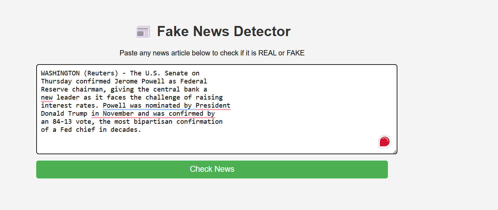
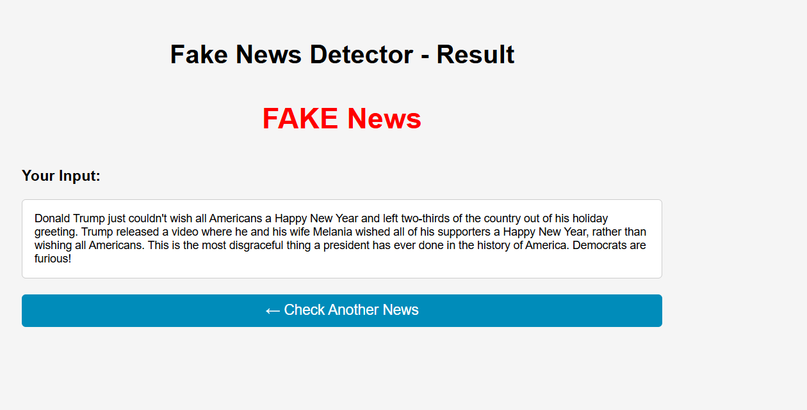
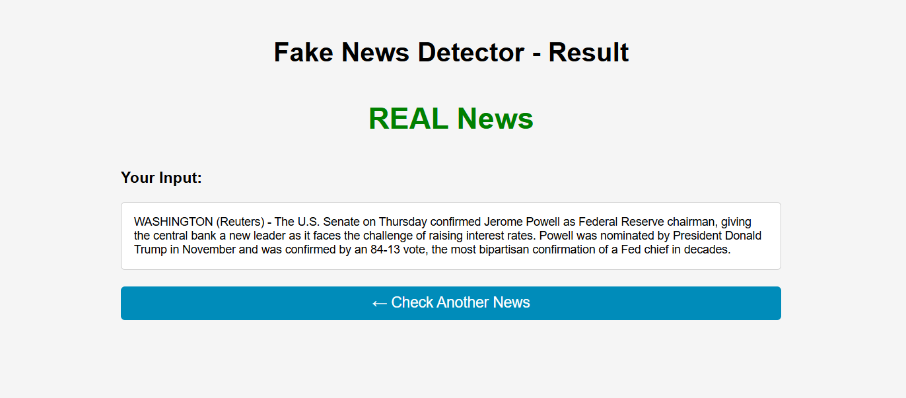

# Fake News Detection Project
# Fake News Detection System

## Description
A Django web application that detects whether a news article 
is REAL or FAKE using Machine Learning.

## Algorithm Used
- Passive Aggressive Classifier
- TF-IDF Vectorization

## Accuracy
- 99.34% accuracy on test data

## Dataset
- Fake.csv - 23,481 fake news articles
- True.csv - 21,417 real news articles
- Total: 44,898 articles

## Installation
pip install -r requirements.txt

## How to Run
1. Clone the repository
2. Install requirements
3. Run server: py manage.py runserver
4. Open browser: http://127.0.0.1:8000

## Project Structure
- ml_model/ - Jupyter notebook and pickle files
- fakenews_app/ - Django app
- templates/ - HTML files
- dataset/ - CSV files (not included in repo)

## Output Screenshots

### Home Page

### Fake News Result

### Real News Result

