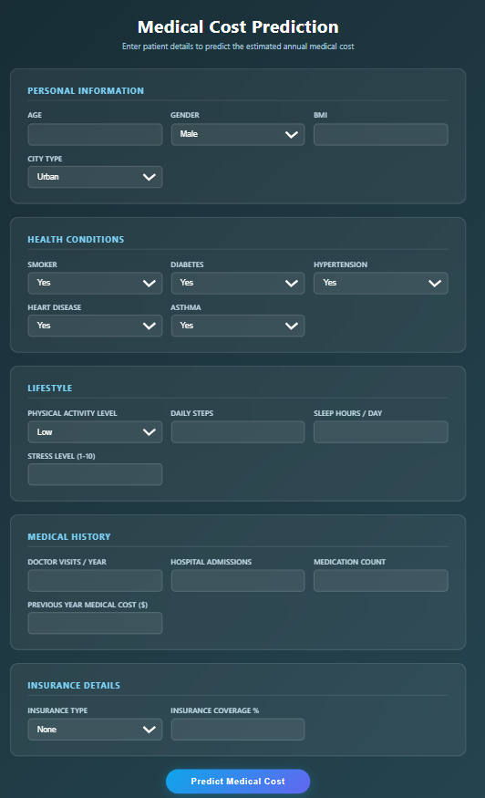
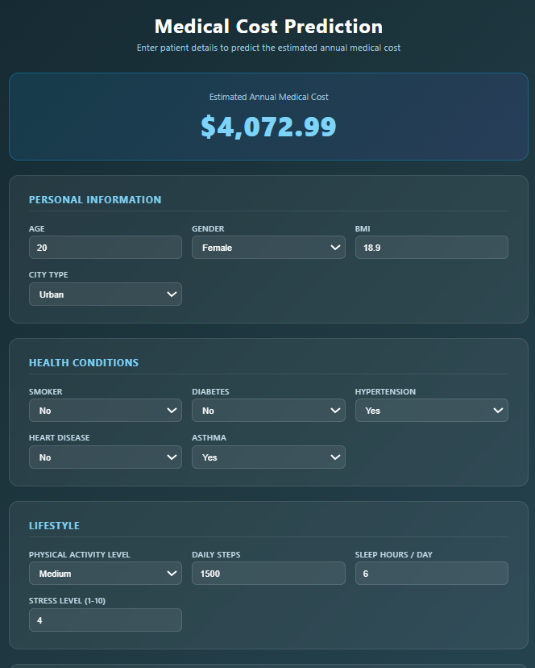
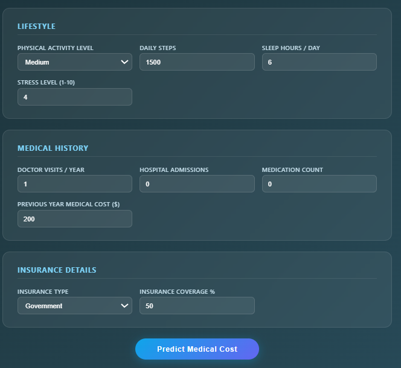

# Medical Cost Prediction System
Submitted By: Pema Dechen Lama 

## Description
A Django web application that predicts the estimated annual medical cost of a patient based on their health information, lifestyle, and insurance details using Machine Learning.

## Algorithm Used
* Random Forest Regressor
* Standard Scaler (Feature Normalization)
* Label Encoder (Categorical Encoding)

## Accuracy
* MAE (Mean Absolute Error): ~$1,200
* R2 Score: ~0.87 on test data

## Dataset
* medical_cost_prediction_dataset.csv - patient records
* Input Features: 19 columns (age, bmi, smoker, diseases, lifestyle, insurance, etc.)
* Target Column: annual_medical_cost
* Minimum Cost: $404.95
* Maximum Cost: $44,792.10
* Average Cost: $8,048.89

* Input Features (19 columns)
Column                   |	Type	          |Description
age                      |	Number	          | Patient age in years
gender                   |	Text	          |Male or Female
bmi	                     |Number	          |Body Mass Index (weight/height²)
smoker                   |Text	              |Yes or No
diabetes                 |	0 or 1	          |Has diabetes or not
hypertension	         |0 or 1	          |Has high blood pressure or not
heart_disease	         |0 or 1	          |Has heart disease or not
asthma	                 |0 or 1	          |Has asthma or not
physical_activity_level	 |Text	              |Low / Medium / High
daily_steps	             |Number	          |Average steps walked per day
sleep_hours	             |Number	          |Hours of sleep per day
stress_level	         |Number	          |Stress level from 1 to 10
doctor_visits_per_year	 |Number	          |Number of doctor visits per year
hospital_admissions 	 |Number	          |Times admitted to hospital
medication_count	     |Number	          |Number of regular medicines taken
insurance_type	         |Text	              |None / Government / Private
insurance_coverage_pct	 |Number	          |Percentage covered by insurance
city_type	             |Text	              |Urban / Semi-Urban / Rural
previous_year_cost	     |Number	          |Medical cost from previous year ($)
annual_medical_cost	     |Number (Float)	  |Predicted annual medical cost in USD (model predicts this) 


## Installation
```
pip install -r requirements.txt
pip install django scikit-learn pandas joblib
```

## How to Run
1. Clone the repository
2. Place `medical_cost_prediction_dataset.csv` in the project root
3. Install requirements
4. Train the model: `python train_model.py`
5. Run server: `py manage.py runserver`
6. Open browser: http://127.0.0.1:8000

## Project Structure
* `train_model.py` - Trains the Random Forest model and saves artifacts
* `predictor/` - Django app
* `predictor/ml/` - Saved pickle file (medical_cost_artifacts.pkl)
* `predictor/templates/` - HTML files
* `medical_cost_prediction_dataset.csv` - Dataset (not included in repo)

## How the System Works
* The complete flow from user input to prediction result:

1.	User opens the web form in the browser
2.	User fills in all 19 health fields (age, BMI, smoker, diseases, etc.)
3.	User clicks 'Predict Medical Cost' button — form is submitted
4.	views.py receives the form data
5.	forms.py validates all inputs (checks correct ranges and types)
6.	ml_service.py encodes categorical fields using LabelEncoder
7.	ml_service.py normalizes numeric fields using StandardScaler
8.	Random Forest model (300 trees) makes prediction
9.	Average of all 300 tree predictions is returned
10.	Result is displayed on screen: e.g. $8,450.00

## Limitations
1. Dataset is US-based — predictions reflect US healthcare costs, not Nepal
2. Model cannot predict below the minimum cost in training data ($404.95)
3. previous_year_cost field has high influence on prediction
4. Model accuracy depends on quality and size of training data

## Conclusion
* This project successfully demonstrates how Machine Learning (Random Forest Regression) can be applied to predict healthcare costs. The Django web application provides an easy-to-use interface where any user can input their health information and receive an instant estimated annual medical cost. The system can be useful for hospitals, insurance companies, and individuals for healthcare financial planning.

## Output Screenshots





