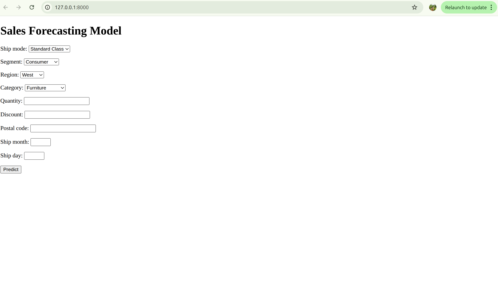

# Sales Forecasting Web Application

## Project Title

Sales Forecasting using Machine Learning with Django


## Description

This project is a simple web application that predicts sales based on different input factors like shipping mode, region, category, quantity, discount, and date details.

I built this using Django for the backend and a machine learning model (Linear Regression) to make predictions. The goal of the project is to combine machine learning with a web interface so users can easily input data and get a sales prediction instantly.


## Dataset Used

The model was trained on a sales dataset that includes information such as:

* Ship Mode
* Segment
* Region
* Category
* Quantity
* Discount
* Postal Code
* Date-related features (like month and day)
* Sales (target variable)

Before training, categorical data was converted into numerical form using label encoding.


## Installation Steps

1. Clone the repository

```
git clone <your-repo-link>
```

2. Go to the project folder

```
cd machine-learning-pratistha-sales-forecasting
```

3. Create a virtual environment

```
python -m venv venv
```

4. Activate the environment

```
source venv/bin/activate
```

5. Install required packages

```
pip install -r requirements.txt
```

---

## How to Run the Project

1. Apply migrations

```
python manage.py migrate
```

2. Start the server

```
python manage.py runserver
```

3. Open your browser and go to

```
http://127.0.0.1:8000/
```


## Output

The application provides a form where users can enter input values. After submitting the form, it displays the predicted sales value.



Example:
Predicted Order Sales: $41,248.94

This value represents the estimated sales amount for a single order based on the given inputs.


## Notes

* The prediction is based on the trained machine learning model and may not be 100% accurate.
* The result depends on the quality of the dataset and preprocessing done during training.


## Author

Pratistha Bhandari

