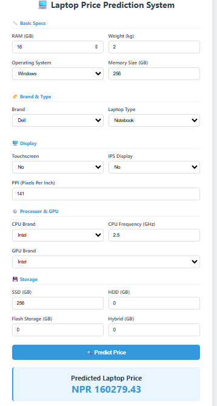

### Title:
Laptop Price Prediction System

### Description:
This project predicts laptop prices in NPR based on features such as RAM, CPU, GPU, weight, operating system, memory size (GB), brand, and laptop type. It uses a Random Forest model trained on a dataset of laptops. The system is deployed using a Django web application where users can input laptop specifications and get a predicted price.

### Dataset:
I used the laptop_price.csv (contains specs + price in Euros). Price converted to NPR using 1 Euro ≈ 133 NPR.

### Installation steps:
Go in the terminal and type:
pip install numpy pandas scikit-learn seaborn matplotlib joblib django jupyter

## How to Run
1. Clone the repository and open the project folder
2. Install required libraries using pip
3. Make sure `laptop_price.csv` is in the project directory
4. Open Jupyter Notebook using `jupyter notebook`
5. Open `laptop_price_prediction.ipynb`
6. Run all cells step by step
7. View graphs, accuracy comparison, and predictions
8. Final model will be saved as `.pkl` file

### Output Screenshots
I have provided the output screenshot of laptop price prediction after the deployment interface.

